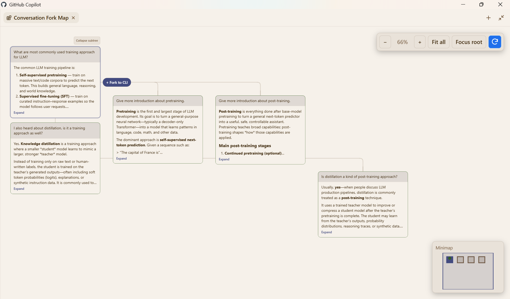

# Conversation Fork Map

Conversation Fork Map is an experimental GitHub Copilot Canvas Extension for
exploring and branching local Copilot conversations.

It renders a conversation family as session lanes in a side-panel canvas.
Shared history stays in the parent lane, child lanes begin at their fork
checkpoint, and the current session is highlighted. From any completed turn,
you can create a CLI-only child session and continue it with the generated
`copilot --resume=<session-id>` command.



## Features

- View a complete conversation family without duplicating inherited turns.
- Pan, zoom, fit, and navigate large conversation maps.
- Inspect user prompts, Copilot responses, and expandable execution details.
- Fork any completed turn from an available family session.
- Track session names, summaries, availability, and live transcript updates.
- Preserve missing sessions as tombstones instead of silently dropping lineage.

## Requirements

- GitHub Copilot App / Copilot CLI **1.0.80 or newer** with Canvas support.
- A local Copilot session. Cloud and remote sessions are not supported.
- Read access to the local Copilot event logs under
  `$COPILOT_HOME/session-state` (or `~/.copilot/session-state` when
  `COPILOT_HOME` is not set).
- The Canvas, metadata, local session listing, occupancy, and session fork
  capabilities supplied by the compatible Copilot runtime.

The extension uses the Node.js runtime and Copilot SDK provided by Copilot. No
`npm install` step is required. Installing from source with the included script
also requires Git and PowerShell 7 (`pwsh`).

## Installation

### Install the 0.0.3 release

Ask Copilot to install the extension from the following GitHub folder and
choose the **User** scope:

```text
https://github.com/jdneo/copilot-chat-map/tree/0.0.3/extensions/chat-fork-map
```

Reload extensions in Copilot after installation.

### Install from source

```powershell
git clone https://github.com/jdneo/copilot-chat-map.git
Set-Location copilot-chat-map
pwsh -File .\scripts\install-user-extension.ps1
```

The installer copies the extension to
`$COPILOT_HOME/extensions/chat-fork-map`, or
`~/.copilot/extensions/chat-fork-map` when `COPILOT_HOME` is not set. Running
it again upgrades the implementation while preserving the current lineage
index.

## Usage

Open a local Copilot session, reload extensions, and run:

```text
/fork-map
```

You can also ask Copilot to open the Conversation Fork Map. Select a completed
turn, then choose the circular **+** on its right border (tooltip: **Fork to
CLI**). After the child is created, run the displayed command in a terminal:

```text
copilot --resume=<session-id>
```

## Local data and privacy

The extension reads each family member's native `events.jsonl` file without
modifying it. It creates structured lineage only after the first successful
fork and stores it locally at:

```text
$COPILOT_HOME/extensions/chat-fork-map/artifacts/lineage-v1.json
```

The lineage index records session relationships and fork checkpoints, not
copies of message content. The installer never writes to or removes files from
Copilot's native `session-state` directory.

## Known limitations

- Only local Copilot sessions are supported.
- Forked children are CLI-only runtime sessions. They may not appear in the
  Copilot App session list, and the Canvas API cannot switch the App's Chat View
  to them. Continue a child with `copilot --resume=<session-id>`.
- Only forks created through Conversation Fork Map are tracked. Existing
  branches created with `/fork` or other tools are not imported automatically.
- Only completed turns can be used as fork checkpoints. Forking is disabled
  while the current session is processing or when another source session is in
  use.
- The canvas is for visualization and branching; it does not provide chat,
  full-text search, session rename/delete, or lineage re-parenting.
- Lineage is stored on the local machine and is not synchronized across devices.
- Canvas/session RPCs and the local `events.jsonl` format are experimental
  compatibility surfaces and may require updates in future Copilot releases.

## Development

Run the test suite with:

```powershell
node --test
```

## License

Licensed under the [MIT License](LICENSE).
