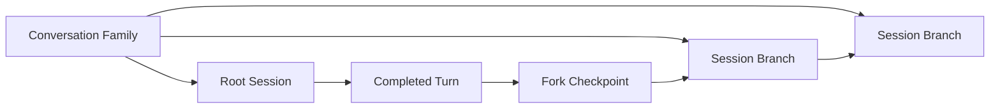
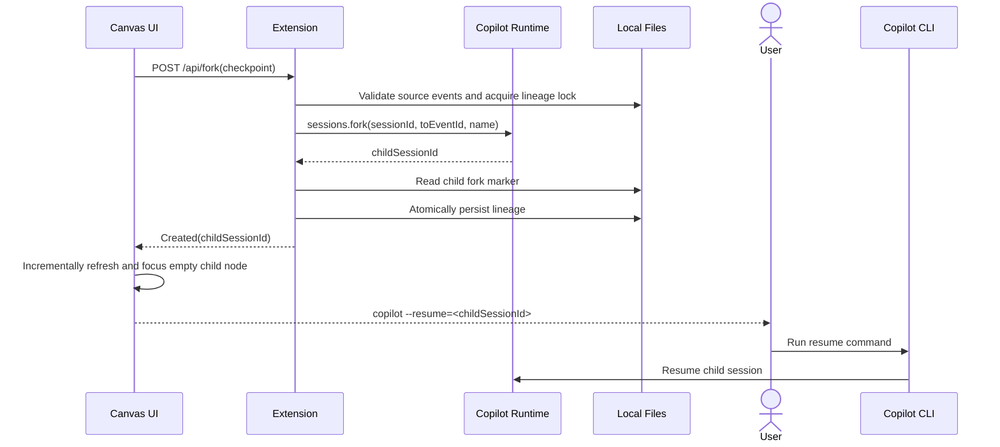

# Conversation Fork Map 方案

状态：已实现
目标版本：GitHub Copilot App / CLI 1.0.80+
交付范围：Agent Plugin 中的 `chat-fork-map` Canvas Extension，兼容用户级直接安装

## 1. 目标

提供一张可平移、缩放的会话分叉画布，让用户：

1. 同时阅读一个会话族中的全部相关分支。
2. 从任意可用分支的完整轮次创建新分支。
3. 创建成功后在新分支节点完成明确的 CLI Handoff。
4. 区分 App 中的 Current Session 与 CLI-only Session Branch。

画布负责全局阅读、分叉和 CLI Handoff，不承担聊天输入或 agent 执行。

## 2. 首版范围

### 包含

- 本地 Copilot App / CLI 会话。
- `/fork-map` 与自然语言打开入口。
- 完整会话族的树状分支泳道。
- 轮次选择、分叉和空分支 CLI Handoff。
- 文件变化近实时刷新、手动刷新与低频校准。
- 长内容折叠、执行详情展开、子树折叠。
- 二维拖动、缩放、小地图、适应全部、回到当前分支。
- 缺失会话和缺失检查点的墓碑展示。

### 不包含

- 画布内聊天。
- 云端或远程会话。
- 画布外创建的 `/fork` 分支导入。
- 全文或语义搜索。
- 会话重命名、删除或血缘重新挂接。
- 自动推断未知会话之间的关系。

## 3. 领域模型

规范术语见 [CONTEXT.md](CONTEXT.md)。

核心关系如下：



关键约束：

- 一个节点代表一轮完整应答，而不是单条消息。
- 一轮包含用户输入、Copilot 最终回复和可展开的执行详情。
- 只有已完成轮次可以成为分叉检查点。
- 每个非根会话恰好有一个父会话和一个来源检查点。
- 同一检查点可以创建多个子分支。
- 画布只追踪由该画布创建的分支。

## 4. 用户体验

### 4.1 打开画布

- 用户运行 `/fork-map`，或用自然语言要求打开 Conversation Fork Map。
- 画布不自动弹出。
- 当前会话尚未被追踪时，先以单节点会话族临时展示。
- 仅在第一次成功分叉后写入持久血缘索引。
- 从任意已追踪子会话打开时，恢复完整会话族并聚焦当前会话。

### 4.2 画布结构

- 每个会话是一条纵向泳道。
- 每个完整轮次是泳道中的一个节点。
- 子泳道从来源轮次向右展开。
- 横向位置表示分叉深度。
- 同级分支按创建时间固定排序，不因活跃度重新排列。
- 当前会话与根到当前会话的路径使用视觉高亮。

原生 fork 会复制祖先事件，但画布不重复展示：

- 共享历史只在祖先泳道显示一次。
- 子泳道从 fork 之后的第一轮开始显示。
- 空子泳道节点显示继承轮次数，并可定位回来源检查点。

### 4.3 轮次节点

节点使用已确认的紧凑角色色带：

- 用户输入与 Copilot 回复位于同一个节点。
- 双方通过不同色带和背景区分。
- 用户输入默认最多显示 3 行。
- Copilot 回复默认最多显示 8 行。
- 两部分均可独立展开全文。
- 代码块展示首段并标明隐藏行数。
- 工具调用与结果折叠在 `Execution details` 中。

所有控件、状态、空状态、工具提示和导航文案使用英文。会话名称与消息正文保持原始语言。

### 4.4 选择与分叉

- 点击完整轮次节点将其选为检查点。
- 选中后，节点右边框中点显示一个 28px 圆形描边 `+` 按钮；按钮中心与边框重合，不显示常驻文字标签，悬停时使用蓝色填充。
- 所有 Turn Node 的消息区域固定保留 20px 左右边距，选择前后正文宽度和换行保持不变。
- 按钮的无障碍名称为 `Fork to CLI`，tooltip 同时明确说明 child 是 CLI-only，不会出现在 Copilot App session list。
- 未选中节点不显示该按钮。
- 当前前台会话处于 agent turn 运行状态时，所有分叉按钮禁用。
- 进行中、中断或缺少最终回复的轮次仍显示，但不可分叉。
- 墓碑会话和缺失检查点不可分叉。

点击圆形 `+` 后：

1. 禁用按钮，防止重复提交。
2. 从该轮次之后的事件边界调用 `sessions.fork`。
3. 使用本地字符串处理生成名称，不调用模型。
4. 成功记录血缘后刷新画布。
5. 自动滚动到新 child 的既有空节点，不播放进入动画，也不显示重复 success toast。
6. 在节点内显示 `copilot --resume=<childSessionId>`，由用户在终端继续。

自动名称格式：

```text
<normalized and truncated user prompt> · Branch N
```

- `N` 为同一检查点下的创建顺序。
- 仅压缩空白、移除控制字符并截断。
- 缺少文本时使用 `Untitled branch N`。
- 命名过程不产生模型请求或额外 credit。

### 4.5 CLI Handoff

- 空 child 复用既有 `branch-entry / virtual turn`，不增加泳道标题或额外节点。
- 可用且未占用时显示 success 状态、简短 App 限制说明和唯一 CLI 命令。
- 已被 CLI 占用但尚无首轮对话时显示 `Branch active in Copilot CLI`，隐藏 resume 命令。
- 首轮对话出现后，空节点消失，只显示真实 Turn Node。
- Map 只负责首次 handoff；已有对话分支以后通过 `copilot --resume` picker 恢复。
- 不提供 Canvas composer、进程启动、clipboard action 或 App 导航按钮。

### 4.6 大图导航

- 在空白区域拖动画布。
- 支持缩放。
- 文本区域仍可正常选择。
- 右下角显示小地图。
- 提供 `Fit all` 与 `Focus current`。
- 超大树默认折叠非当前子树，但不丢弃数据。

首版验收规模：

- 单个会话族最多 50 个会话。
- 累计最多 5,000 个完整轮次。

## 5. 数据来源

### 5.1 会话内容

消息正文直接只读解析 Copilot 的本地事件文件，不复制到扩展存储。

| 平台 | 默认路径 |
|---|---|
| Windows | `%USERPROFILE%\.copilot\session-state\<sessionId>\events.jsonl` |
| macOS / Linux | `$HOME/.copilot/session-state/<sessionId>/events.jsonl` |

若设置 `COPILOT_HOME`，路径改为：

```text
$COPILOT_HOME/session-state/<sessionId>/events.jsonl
```

`XDG_*`、`APPDATA` 和 `LOCALAPPDATA` 不用于当前会话状态目录。首版不读取旧版 `history-session-state`。

路径解析要求：

- 使用 `COPILOT_HOME`，否则使用 `os.homedir()/.copilot`。
- 只接受当前会话或血缘索引中已有的 session ID。
- 校验 session ID 格式。
- 规范化路径并确认结果仍位于 `session-state` 下。
- 只读文件，绝不修改原生事件日志。
- 不依赖内部、未稳定公开的 `sessions.getEventFilePath` RPC。

### 5.2 会话元数据

通过公开 session RPC 获取：

- 会话名称和摘要。
- 最后修改时间。
- 本地/远程类型。
- 是否被其他进程占用。

远程会话直接显示不支持状态。

### 5.3 血缘索引

扩展只持久化结构化血缘和用户的隐藏状态，不持久化消息正文。

位置：

```text
$COPILOT_HOME/extensions/chat-fork-map/artifacts/lineage-v1.json
```

概念结构：

```json
{
  "version": 1,
  "revision": 12,
  "families": {
    "<rootSessionId>": {
      "familyId": "<rootSessionId>",
      "rootSessionId": "<rootSessionId>",
      "createdAt": "<ISO timestamp>",
      "members": {
        "<sessionId>": {
          "sessionId": "<sessionId>",
          "parentSessionId": "<parentSessionId or null>",
          "sourceUserEventId": "<eventId or null>",
          "sourceAssistantEventId": "<eventId or null>",
          "toEventId": "<first excluded eventId or null>",
          "childForkMarkerEventId": "<eventId or null>",
          "siblingOrdinal": 1,
          "createdAt": "<ISO timestamp>"
        }
      },
      "hiddenSessionIds": []
    }
  },
  "sessionToFamily": {
    "<sessionId>": "<rootSessionId>"
  }
}
```

写入规则：

- 使用跨进程排他锁。
- 临时文件写入、刷新后原子替换。
- 每次写入递增 `revision`。
- 不允许出现环、多个父节点或跨会话族父节点。
- 首次 fork 前不创建 family。

原生 `session.info { infoType: "fork" }` 只用于诊断和人工恢复，不作为日常血缘协议，因为父子 ID 位于非结构化文本中。

## 6. 事件解析

### 6.1 JSONL 读取

- 流式逐行解析。
- 允许正在写入的最后一行暂时不完整，下一次刷新继续读取。
- 中间行损坏时停止在最后一个可信偏移量并显示错误，不静默跳过。
- 文件缩短、替换或 inode 改变时从头重建该会话缓存。
- 缓存仅存在于内存，扩展重启后重新读取。

### 6.2 轮次分组

主泳道只使用根 agent 的用户可见事件：

- 排除 ephemeral 事件。
- 排除带 `agentId` 的子代理主消息。
- 排除 skill、agent 和内部注入的伪用户消息。
- 一个可见用户消息开始一轮。
- 其后的主 agent 工具调用、结果与 Copilot 消息归入该轮。
- 下一条可见用户消息开始下一轮。

完成规则：

- 存在用户输入。
- 存在主 agent 的最终 `assistant.message`。
- 当前会话没有仍在执行的对应 turn。

工具调用、权限、子代理和内部状态不进入主文本，只进入可展开执行详情。

### 6.3 分叉边界

选择一轮后：

- `sourceUserEventId` 指向该轮用户消息。
- `sourceAssistantEventId` 指向该轮最终 Copilot 回复。
- `toEventId` 指向下一轮的首个可见用户事件。
- 若选择最后一个完整轮次，`toEventId` 省略，表示复制到文件末尾。

这样 `sessions.fork` 会包含所选完整轮次，并排除后续对话。

### 6.4 子分支增量

fork 完成后，读取子会话中新写入的 `session.info` fork 标记，并保存其事件 ID。渲染子泳道时只显示该标记之后的新轮次。

若标记缺失：

1. 使用父会话事件 ID 和 `toEventId` 计算共享前缀。
2. 无法可靠确定时显示不可用状态，不猜测边界。

## 7. 分叉与 CLI Handoff 事务



顺序约束：

- 只有 `sessions.fork` 成功后才记录子会话。
- fork 失败时不写入索引。
- fork 成功但索引失败时，显示不会自动消失的 recovery notice、CLI 命令和 `do not retry`。
- 索引成功后不调用命令队列或任何 App 导航接口。
- UI 重试前必须刷新状态，避免重复 fork。

CLI Handoff 使用：

```text
copilot --resume=<sessionId>
```

该命令只作为可选择文本展示，不由扩展执行或复制。扩展不使用模型消息、字符串 prompt 或私有 RPC 兜底。

## 8. 刷新模型

画布打开期间：

- 监听已知会话目录中的 `events.jsonl`。
- 文件变化后按固定时间窗节流，连续写入期间不会无限推迟刷新，并在最后一次变化后完成补刷。
- 使用 Server-Sent Events 通知 iframe 重新获取状态。
- iframe 继续获取完整状态快照，但按稳定的 Session/Turn ID 原位协调 DOM；首次加载后不替换 viewport、stage 或 family 容器。
- 自动同步静默执行并保留缩放、平移、滚动、选择和展开状态；失败时保留最后成功的 Map 并显示错误。
- 提供 `Refresh`。
- 低频轮询校准文件监听漏报。
- 检测会话名称、删除状态和占用状态变化。

建议参数：

- 文件变化节流：250 ms。
- 校准轮询：15 s。
- 同一轮解析任务合并，避免并发重读。

## 9. 缺失与异常状态

| 情况 | 行为 |
|---|---|
| 会话事件文件缺失 | 保留 `Session unavailable` 墓碑节点 |
| 父会话缺失但后代存在 | 保留父墓碑和原连接 |
| 来源轮次找不到 | 显示 `Fork checkpoint unavailable` 占位锚点 |
| 会话被外部重命名 | 下次刷新采用最新名称 |
| 当前会话正在运行 | 所有分叉 `+` 按钮禁用，并以不透明的中性色显示 |
| 非当前来源会话被占用 | 该泳道分叉按钮禁用 |
| 空 child 可用且未占用 | 显示 success handoff 和唯一 CLI resume 命令 |
| 空 child 已被 CLI 占用 | 显示 `Branch active in Copilot CLI` 并隐藏命令 |
| JSONL 最后一行不完整 | 暂缓该行，等待下一次刷新 |
| JSONL 中间损坏 | 显示读取错误并保留最后可信内容 |
| fork RPC 失败 | 留在画布，不修改索引 |
| child 已创建但 lineage 写入失败 | 持久展示 child 恢复命令并明确禁止重试 |
| 关键实验能力缺失 | 显示 1.0.80+ 升级或能力缺失说明 |

用户可隐藏失效子树。隐藏只影响画布展示，不删除会话或血缘。

## 10. 扩展结构

发布包遵循 Agent Plugins v1，并将 Canvas 放在 Copilot 客户端命名空间：

```text
chat-fork-map/
├── plugin.json
├── extension.mjs
├── copilot-extension.json
├── extensions/
│   └── chat-fork-map/
│       └── extension.mjs
└── com.github.copilot/
    └── extensions/
        └── chat-fork-map/
```

`extensions/chat-fork-map/extension.mjs` 只用于兼容 Awesome Copilot 当前的
Canvas intake 路径检查，实际实现仍只有 `com.github.copilot/` 下的一份。

通过源码安装脚本安装后，扩展位于
`$COPILOT_HOME/extensions/chat-fork-map/`。Canvas 的模块边界为：

```text
chat-fork-map/
├── extension.mjs       # joinSession、Canvas 与 /fork-map 注册
├── canvas-server.mjs   # loopback HTTP、SSE、请求鉴权
├── family-service.mjs  # 用例编排与状态快照
├── lineage-store.mjs   # 原子索引与跨进程锁
├── event-reader.mjs    # 路径解析、JSONL 增量读取
├── transcript.mjs      # 轮次分组、完成状态与增量去重
├── runtime.mjs         # sessions.fork、list、checkInUse
└── renderer.mjs        # HTML、CSS、客户端交互
```

不添加 `package.json` 或本地 `node_modules`。使用 CLI 自动提供的 `@github/copilot-sdk`。

### Canvas 声明

- Canvas ID：`chat-fork-map`
- Display name：`Conversation Fork Map`
- Description：`Visualize a local Conversation Family and create CLI-only child sessions from completed Turn Nodes.`
- 固定一个逻辑面板实例；再次打开时聚焦并刷新。

Agent/host actions：

- `refresh_map`
- `fork_from_turn`

iframe 中的可点击控件调用本地 HTTP endpoint；Canvas actions 不会自动生成 UI。

## 11. 安全边界

- HTTP server 只绑定 `127.0.0.1` 的随机端口。
- 每个 Canvas instance 使用随机高熵 token。
- mutation endpoint 只接受 POST。
- 请求体设置严格大小上限。
- CSP 默认只允许自身资源和本地连接。
- 不使用 `console.log`，避免破坏 JSON-RPC。
- Markdown 必须清洗。
- 原始 HTML 一律转义。
- 远程图片默认不请求，用户点击后才加载。
- 外部链接使用安全打开策略。
- session ID 不能直接拼接未经校验的用户输入。
- 扩展不扫描未加入当前会话族的事件文件。
- 所有数据留在本机，不上传、不调用模型。

## 12. 性能策略

- 会话文件按偏移量增量解析。
- 每个会话维护内存索引和文件签名。
- 轮次节点使用视口虚拟化。
- 折叠子树不创建完整 DOM。
- Markdown 只在节点进入视口或展开时渲染。
- 小地图使用轻量几何数据，不复制消息 DOM。
- 布局结果按 family revision 与节点尺寸缓存。

性能验收：

- 50 个会话、5,000 个轮次可以打开和导航。
- 首次加载后，单个文件追加不触发全会话族重读。
- 选择节点、展开内容和拖动画布保持可交互。

## 13. 兼容与能力探测

最低目标为 1.0.80。

启动时确认：

- Canvas renderer 可用。
- `session.rpc.sessions.fork` 可用。
- `session.rpc.sessions.list` 可用。
- 会话占用检查可用。
- 当前会话为本地会话。
- `events.jsonl` 根目录可解析且只读。

缺少关键能力时不加载成功形态的空画布，而是显示具体缺失项和升级建议。

## 14. 旧原型处理

实现阶段直接替换现有 `user:chat-fork-map`：

- 删除旧扩展代码。
- 删除旧扩展自定义 artifacts。
- 不迁移旧血缘或消息快照。
- 不删除任何 Copilot 原生会话目录。
- 新版索引从第一次成功分叉开始建立。

本方案阶段不执行上述操作。

## 15. 验收标准

1. 未追踪会话打开画布时不写入索引。
2. 一个完整轮次显示为一个节点，内部区分 You 与 Copilot。
3. 所有控件文字为英文，消息正文保持原文。
4. 只有选中且已完成的轮次可显示右边框上的圆形分叉 `+` 按钮。
5. 可从任意可用泳道的完整轮次创建分支。
6. fork 精确包含所选轮次并排除后续轮次。
7. 分支名称不调用模型。
8. 首次成功 fork 后才持久化会话族。
9. 创建成功后自动聚焦既有空节点，并仅显示一个 `copilot --resume=<id>` 命令。
10. child 已创建但 lineage 失败时显示持久 recovery notice，且不会重复创建。
11. 从子会话重开画布可恢复完整会话族并聚焦当前会话。
12. 子泳道不重复显示祖先历史。
13. 文件追加可近实时原位反映到画布，不替换既有 Map、Lane 或 Turn DOM。
14. 缺失会话和缺失检查点保持原血缘并显示墓碑。
15. 安全 Markdown 不执行原始 HTML，远程图片不自动加载。
16. 50 个会话、5,000 个轮次满足性能目标。
17. 画布只读取当前会话族中的本地事件文件。
18. 旧原型数据不会进入新模型。

## 16. 已知风险

| 风险 | 缓解 |
|---|---|
| Canvas 与 session RPC 为实验接口 | 固定最低版本并启动时探测 |
| runtime child 不会出现在 Copilot App session list | fork 前标明 CLI-only，成功后在空节点完成 CLI Handoff |
| `events.jsonl` schema 未来变化 | 版本化解析器、严格错误状态、fixture 测试 |
| `fs.watch` 跨平台可能漏报 | 手动刷新与低频轮询校准 |
| 多窗口同时分叉 | 跨进程锁、revision 和原子替换 |
| 大型 Markdown 造成 DOM 压力 | 截断、延迟渲染、虚拟化 |

当前没有阻塞实现的未决产品问题。
