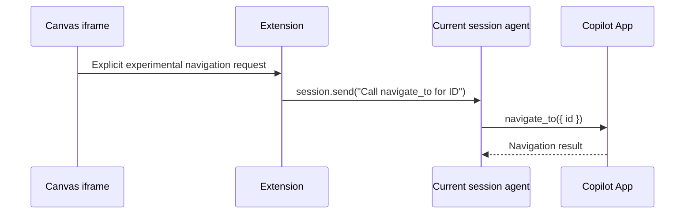
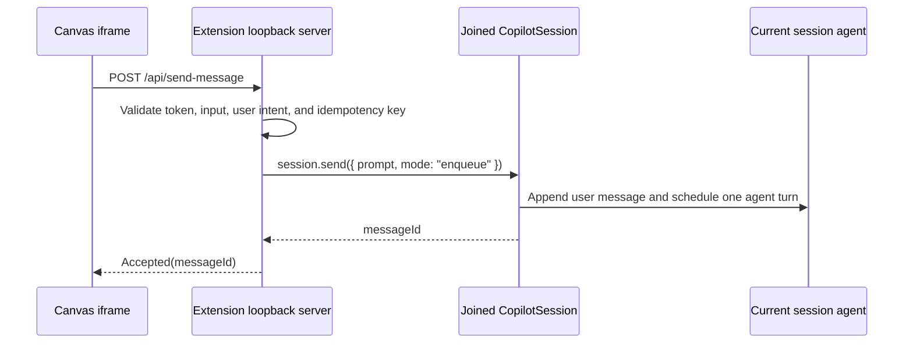

# Canvas-to-Chat session navigation

Research date: 2026-08-20
Issue: [#9 - Research Canvas-to-Chat session navigation in Copilot App](https://github.com/jdneo/copilot-chat-map/issues/9)
Observed host: GitHub Copilot App / CLI 1.0.80
Product decision: 2026-08-25

## Conclusion

The current public Canvas and extension contracts do not provide a supported
operation that switches the Copilot App Chat View to an arbitrary local runtime
session.

Conversation Fork Map therefore treats children created through `sessions.fork`
as CLI-only. It does not expose `Open Chat` or enqueue `/resume`; the empty child
node shows `copilot --resume=SESSION-ID` as the explicit handoff.

The App does expose an agent tool named `navigate_to`. It can switch to an
App-visible chat or project session by ID, but Canvas extensions cannot invoke
App agent tools directly. The extension SDK exposes tool metadata and callbacks,
not a generic host-tool invocation API.

Canvas-originated messaging is possible only in a narrower form:

- An iframe can call its extension through an authenticated loopback HTTP
  endpoint.
- The extension can then call `session.send()` to append a user message to the
  runtime session that the extension has already joined.
- That agent turn may ask the agent to call `navigate_to`, but this is an
  indirect, model-mediated workaround rather than a Canvas navigation API.
- This does not navigate the App, and it does not provide a supported way to
  target another local runtime session.

Therefore, sending a message from the Canvas is not a replacement for the
navigation required by issue #9. It is useful only for explicit actions that
should start another agent turn in the currently joined session.

| Capability | Status | Reason |
|---|---|---|
| Focus an existing Canvas panel | Supported | Reopen the same `instanceId`. This focuses the Canvas panel, not Chat View.[^canvas] |
| Open or focus an arbitrary local runtime session in App Chat View | Unsupported | No Canvas host capability or extension API is declared for session navigation.[^canvas-host] |
| Set the foreground session with `setForegroundSessionId()` | Not applicable to the App host | The SDK limits it to TUI plus `--ui-server`; headless mode rejects it.[^foreground][^foreground-test] |
| Navigate with the App agent's `navigate_to` tool | Supported for App-visible IDs, but not directly callable by extensions | The tool is available to the agent; the extension SDK has no generic host-tool invocation operation. |
| Open an App session with `ghapp://sessions/SESSION_ID` | Supported for an App-visible session, but not a Canvas API | App-managed local sessions may use the same ID, but a runtime-only fork may not yet have an App session entry, and Canvas deep-link dispatch is undocumented.[^deep-links] |
| Send a message to the extension's joined session | Supported | `joinSession()` joins the current foreground session and the returned `CopilotSession` exposes `session.send()`.[^join][^send] |
| Send directly to an arbitrary other session | Unsupported | `session.send()` binds the request to `this.sessionId`; Canvas context exposes no cross-session messaging operation.[^send][^canvas-context] |

## Why Canvas cannot navigate Chat View

### Canvas identifiers are not Chat identifiers

The public Canvas model has three relevant identifiers:

- `canvasId` identifies a Canvas type declared by an extension.
- `instanceId` identifies one rendered Canvas panel.
- `sessionId` in the provider callback identifies the runtime session that owns
  the Canvas invocation.

Reopening an existing `instanceId` is explicitly the path for focusing an
existing Canvas panel. It does not select a different Chat session.[^canvas]

The host context currently advertises only a `canvases` capability. It does not
advertise session navigation, deep-link dispatch, arbitrary session messaging,
or a generic host-command bridge.[^canvas-host]

### `setForegroundSessionId()` has the wrong host contract

`CopilotClient.setForegroundSessionId()` calls `session.setForeground`, but its
SDK contract says it switches the session displayed by the TUI when the runtime
is started with `--ui-server`.[^foreground] The official end-to-end test confirms
that setting a foreground session in headless mode fails with
`Not running in TUI+server mode`.[^foreground-test]

The App-hosted extension also joins through `joinSession()`, which returns a
`CopilotSession`, not the owning `CopilotClient` used by this TUI API.[^join]

### Resume and command RPCs do not prove UI navigation

The following operations affect runtime state or command routing, but none has
a public contract that commits an App Chat View change:

- `sessions.fork` creates a child runtime session.
- `sessions.open({ kind: "resume" })` restores runtime state.
- `commands.execute({ commandName: "resume" })` dispatches to a client that owns
  that command; the App-hosted experiment returned
  `No client found for command: resume`.
- `commands.enqueue({ command: "/resume ..." })` acknowledges queue acceptance,
  not completion of a Chat View transition.

The project must not report successful navigation solely because
`commands.enqueue` returned `queued: true`. The extension does not call this
RPC; `copilot --resume=SESSION-ID` from a terminal is the supported product
path.[^resume]

### The App's `navigate_to` tool

The App agent has a `navigate_to({ id })` tool that switches the UI to an
App-visible project session or chat. This is a real navigation mechanism and is
more precise than asking the runtime to enqueue `/resume`.

It is not, however, part of `CopilotSession` or the Canvas host context. The
extension's `session.rpc.tools` namespace can inspect tool metadata and answer
pending external tool calls, but it cannot invoke an arbitrary App tool.
Likewise, rendering a `<copilot-ref kind="session" ...>` element inside the
Canvas iframe does not inherit the Chat renderer's navigation behavior because
the iframe has no privileged App bridge.

An extension can reach `navigate_to` only indirectly today:



This consumes an agent turn, adds a synthetic user message to the source
conversation, may wait behind an in-progress turn, and depends on the model
choosing the requested tool. It is therefore suitable only as an explicitly
experimental fallback.

## Deep-link finding

GitHub now documents `ghapp://sessions/SESSION_ID` for opening an app-local
workspace or session.[^deep-links] This is the only newly documented App
navigation surface that is close to issue #9, but it does not yet close the
gap:

1. An App-managed local chat can appear in both the runtime store and the App
   session catalog under the same ID.
2. A child created only through `sessions.fork` can exist in the runtime store
   and lineage index without appearing in the App session catalog. No public API
   asks the App to adopt that runtime-only child.
3. The Canvas contract does not expose a host deep-link operation.
4. Ordinary iframe navigation to a custom scheme is not documented as a Canvas
   capability or security boundary.

An anchor or `window.location` experiment with `ghapp://sessions/...` may be
technically interesting, but it should remain an experiment until both the ID
mapping and WebView behavior are documented. It must not become the production
navigation path based only on observed behavior.

## Can the Canvas send a session message?

### Supported scope: the currently joined session

Yes, through the extension rather than through a privileged iframe bridge.
`joinSession()` reads the host-provided `SESSION_ID` and resumes that session for
the extension.[^join] `CopilotSession.send()` then sends `session.send` with
`sessionId: this.sessionId` and returns a message ID.[^send] The official
extension guide describes this as programmatic message sending.[^extension-guide]

The supported flow is:



For this repository, the iframe-to-extension portion matches the existing
authenticated loopback pattern in `com.github.copilot/extensions/chat-fork-map/canvas-server.mjs`. A Canvas action
handler could call the same service, but Canvas actions are agent-invocable
runtime actions; iframe buttons are not wired to them automatically.[^canvas-action]

### Unsupported scope: another branch or App session

The public extension API does not expose an equivalent of
`sendMessage(targetSessionId, ...)`. The joined `CopilotSession` is bound to one
session, and `session.send()` always uses that bound ID.[^join][^send]

Using the private JSON-RPC connection to substitute another `sessionId`, guessing
a host `postMessage` protocol, or prompting the current agent to relay a message
would not be a direct or reliable API:

- A private RPC bypass would depend on undocumented authorization and lifecycle
  behavior.
- A guessed WebView protocol could break without notice and would cross an
  undefined security boundary.
- Asking the agent to relay a message is model-mediated, consumes a turn, and
  cannot provide atomic delivery or navigation guarantees.

### Product and security constraints

A Canvas-originated message is a real user turn, not a UI event. An
implementation should therefore:

- Require an explicit user click and show the exact message or action being
  submitted.
- Prefer a fixed, structured action over arbitrary hidden prompt text.
- Default to queued delivery so an in-progress turn is not unexpectedly
  interrupted.
- Return and display the message ID or a concrete failure.
- Add idempotency and rate limiting to prevent duplicate turns.
- Never treat message acceptance as proof that Chat View navigated.

It will also invoke the agent and may consume a model request. This conflicts
with the current product scope in `SPEC.md`, which says the Canvas does not own
chat input or agent execution. Adopting it would be a deliberate product change,
not merely a navigation implementation detail.

## Recommendation for issue #9

1. Do not render `Open Chat` or enqueue `/resume`. Label the fork action as
   CLI-only before creation, then show `copilot --resume=SESSION-ID` in the
   empty child node.
2. Do not use `session.send()` as a navigation workaround. It can support a
   future opt-in experiment that asks the current agent to invoke `navigate_to`,
   but it is not deterministic host navigation.
3. Track `ghapp://sessions/SESSION_ID` as a separate prototype only after an App
   session entry can be obtained for each forked runtime session and
   Canvas-origin deep-link dispatch is documented.
4. Request an App-host capability that atomically resolves the runtime session,
   opens or focuses the corresponding App Chat View, and reports UI completion.

A suitable contract would be:

```text
capabilities.sessionNavigation.openLocalSession = true

session.ui.openLocalSession({
  runtimeSessionId,
  focus: true
})

=> {
  status: "opened",
  runtimeSessionId,
  appSessionId
}
```

Required behavior:

- Resolve only after the App commits the Chat View change.
- Return typed `not_found`, `in_use`, `unsupported`, and `denied` failures.
- Restrict navigation to local sessions visible to the current user.
- Advertise capability support before the extension renders any App navigation
  control.
- Define whether opening a bare runtime session creates an App session record.
- Keep navigation separate from message sending.

If cross-session messages are later required, they need a separate capability
with explicit target authorization, user confirmation, delivery mode, and an
observable delivery result.

## Unverified items

- Whether the current App WebView happens to dispatch a clicked `ghapp://` link.
  This is not part of the published Canvas contract.
- Whether the App has a private runtime-session-to-app-session mapping. No public
  API for it was found.
- Whether a future App release will expose navigation or cross-session messaging
  in `CanvasHostContextCapabilities`.

These unknowns do not change the supported implementation conclusion above.

[^canvas]: [Copilot SDK Canvas lifecycle and `instanceId` focus semantics](https://github.com/github/copilot-sdk/blob/ea41dadb199725766d5097f4592c17be3200035f/nodejs/src/canvas.ts#L15-L24)
[^canvas-host]: [Generated `CanvasHostContextCapabilities`](https://github.com/github/copilot-sdk/blob/ea41dadb199725766d5097f4592c17be3200035f/nodejs/src/generated/rpc.ts#L5035-L5054)
[^canvas-context]: [Generated Canvas action context](https://github.com/github/copilot-sdk/blob/ea41dadb199725766d5097f4592c17be3200035f/nodejs/src/generated/rpc.ts#L5230-L5263)
[^foreground]: [Copilot SDK foreground-session API](https://github.com/github/copilot-sdk/blob/ea41dadb199725766d5097f4592c17be3200035f/nodejs/src/client.ts#L2294-L2348)
[^foreground-test]: [Official headless foreground-session test](https://github.com/github/copilot-sdk/blob/ea41dadb199725766d5097f4592c17be3200035f/nodejs/test/e2e/client_api.e2e.test.ts#L75-L88)
[^deep-links]: [GitHub Docs: available Copilot App deep links](https://docs.github.com/en/copilot/how-tos/github-copilot-app/open-with-deep-links#available-app-links)
[^join]: [Copilot SDK extension `joinSession()`](https://github.com/github/copilot-sdk/blob/ea41dadb199725766d5097f4592c17be3200035f/nodejs/src/extension.ts#L96-L137)
[^send]: [Copilot SDK `CopilotSession.send()`](https://github.com/github/copilot-sdk/blob/ea41dadb199725766d5097f4592c17be3200035f/nodejs/src/session.ts#L675-L710)
[^extension-guide]: [Official extension guide: programmatic `session.send()`](https://github.com/github/copilot-sdk/blob/ea41dadb199725766d5097f4592c17be3200035f/nodejs/docs/agent-author.md#sessionsendoptions)
[^canvas-action]: [Official Canvas action round-trip test](https://github.com/github/copilot-sdk/blob/ea41dadb199725766d5097f4592c17be3200035f/nodejs/test/e2e/canvas.e2e.test.ts#L119-L145)
[^resume]: [GitHub Docs: resuming a previous CLI session](https://docs.github.com/en/copilot/how-tos/copilot-cli/use-copilot-cli/chronicle#resuming-a-previous-session)
